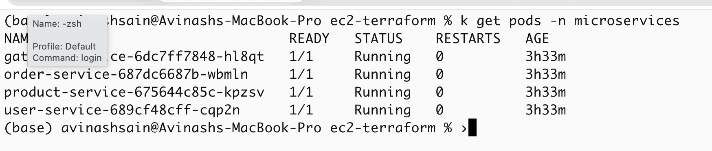
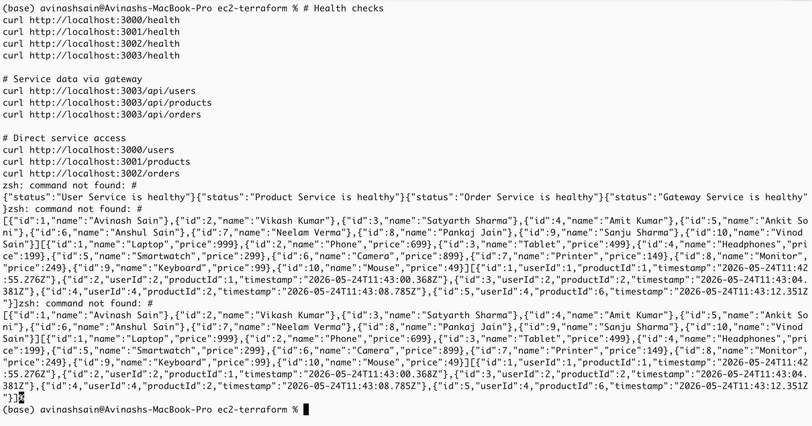
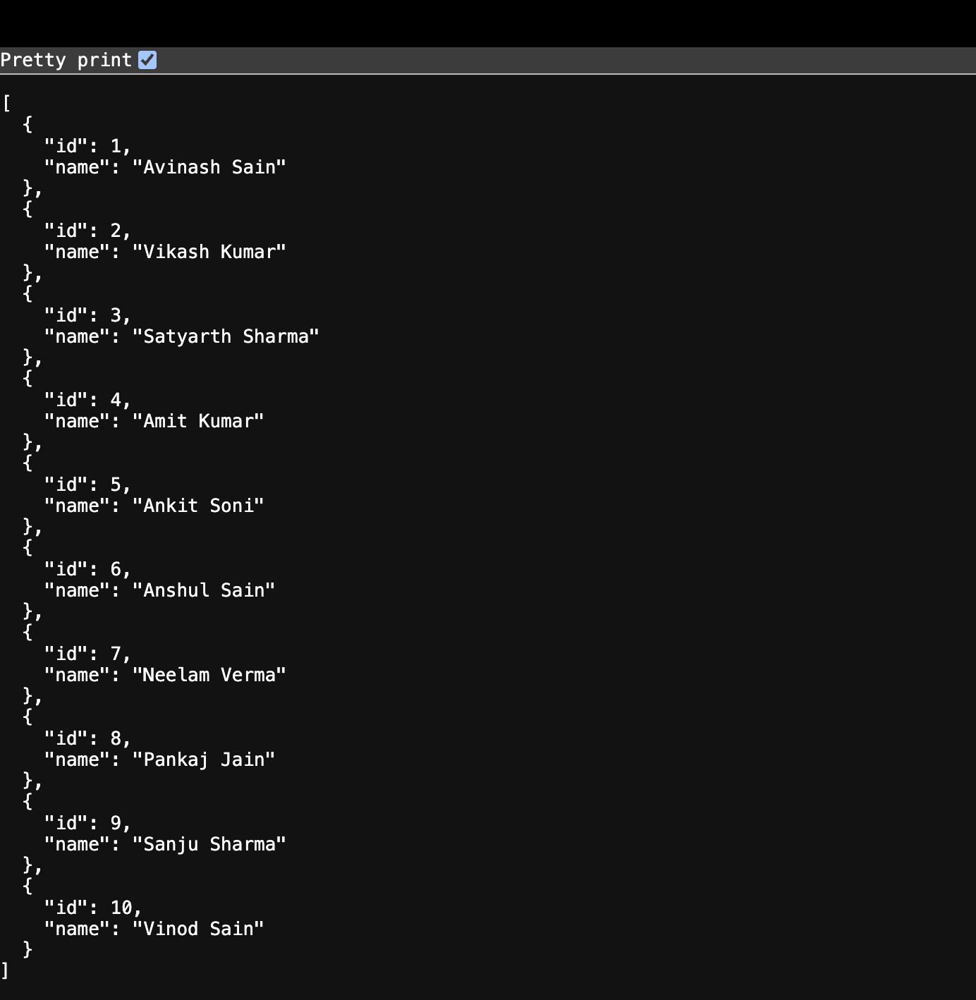
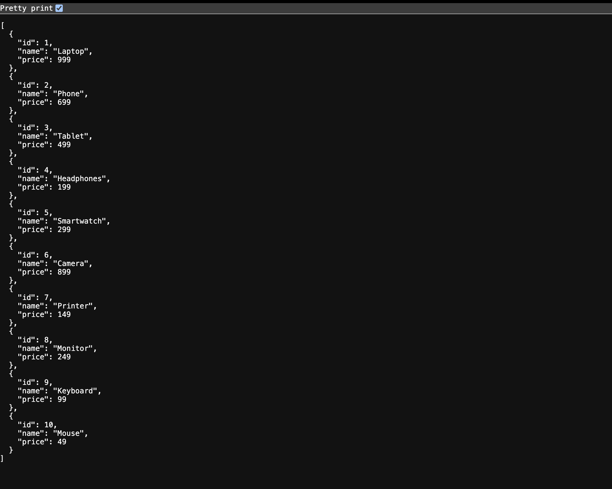
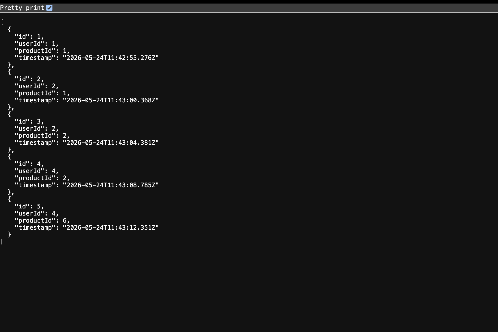
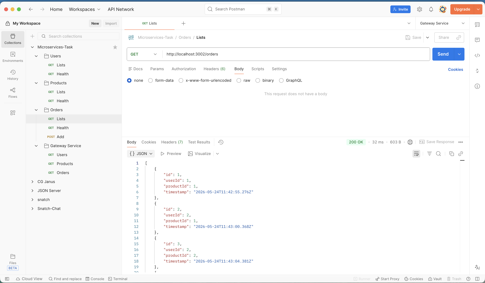
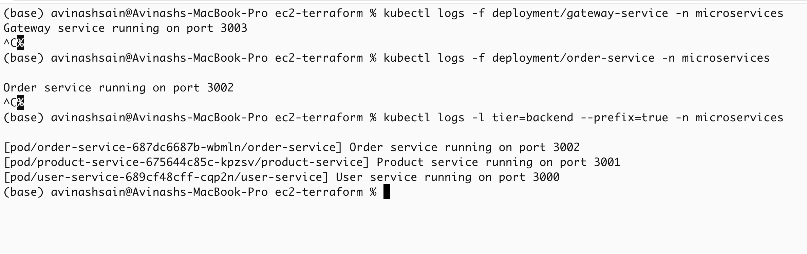

# Microservices on Kubernetes (Minikube)

<div align="center">


**A production-style microservices deployment on local Kubernetes using Minikube**

**Author:** Avinash Sain &nbsp;|&nbsp; **GitHub:** [Avinashsain](https://github.com/Avinashsain) &nbsp;|&nbsp; **Docker Hub:** [avinashsain65](https://hub.docker.com/u/avinashsain65)

</div>

---

## Table of Contents

- [Overview](#overview)
- [Architecture](#architecture)
- [Project Structure](#project-structure)
- [Tech Stack](#tech-stack)
- [Prerequisites](#prerequisites)
- [Getting Started](#getting-started)
- [Service Endpoints](#service-endpoints)
- [Testing](#testing)
- [Bonus: Ingress](#bonus-ingress-configuration)
- [Kubernetes Configuration](#kubernetes-configuration-details)
- [Troubleshooting](#troubleshooting)
- [Future Scope](#improvements-future-scope)

---

## Overview

This project demonstrates a **microservices architecture** using Node.js, fully containerized with Docker and deployed on **Kubernetes using Minikube**.

### Key Features

- **Service Discovery** via Kubernetes ClusterIP DNS
- **Health Probes** — liveness & readiness on every pod
- **Resource Management** — CPU & memory requests/limits
- **API Gateway** — single entry point proxying to all services
- **NGINX Ingress** — path-based routing (bonus)
- **Docker Hub** — images published at `avinashsain65/*`

### Services

| Service          | Port | Kubernetes Type | Docker Hub Image                          |
|------------------|------|-----------------|-------------------------------------------|
| User Service     | 3000 | ClusterIP       | avinashsain65/user-service:latest        |
| Product Service  | 3001 | ClusterIP       | avinashsain65/product-service:latest     |
| Order Service    | 3002 | ClusterIP       | avinashsain65/order-service:latest       |
| Gateway Service  | 3003 | NodePort        | avinashsain65/gateway-service:latest     |

---

## Architecture

```
                        ┌──────────────────────────────────────┐
                        │         Minikube Cluster              │
                        │                                       │
  External Traffic ───► │   gateway-service (NodePort :30003)  │
                        │              │                        │
                        │    ┌─────────┼──────────┐            │
                        │    ▼         ▼          ▼            │
                        │ user-svc  product-svc  order-svc     │
                        │  :3000     :3001        :3002         │
                        │ (CIP)      (CIP)       (CIP)          │
                        └──────────────────────────────────────┘

  CIP = ClusterIP (internal only, DNS-based discovery)
```

**Request Flow:**
```
Client
  └─► GET /api/users
        └─► gateway-service:3003
              └─► [proxy] http://user-service:3000/users
                    └─► Response ◄── JSON data
```

---

## Project Structure

```
submission/
├── deployments/                  # Kubernetes Deployment manifests
│   ├── user-service.yaml         #   Port 3000, ClusterIP
│   ├── product-service.yaml      #   Port 3001, ClusterIP
│   ├── order-service.yaml        #   Port 3002, ClusterIP
│   └── gateway-service.yaml      #   Port 3003, NodePort + proxy env vars
├── services/                     # Kubernetes Service manifests
│   ├── user-service.yaml         #   ClusterIP
│   ├── product-service.yaml      #   ClusterIP
│   ├── order-service.yaml        #   ClusterIP
│   └── gateway-service.yaml      #   NodePort :30003
├── ingress/
│   └── ingress.yaml              # NGINX Ingress with path-based routing
├── screenshots/
│   ├── pods.png                  # kubectl get pods output
│   ├── logs.png                  # Inter-service communication logs
│   └── service-test.png          # curl / port-forward test results
└── README.md
```

---

## Tech Stack

| Tool              | Purpose                          | Version  |
|-------------------|----------------------------------|----------|
| Node.js           | Runtime for all services         | 22 LTS   |
| Express.js        | HTTP framework                   | ^4.18    |
| Docker            | Containerization                 | Latest   |
| Minikube          | Local Kubernetes cluster         | v1.30+   |
| kubectl           | Kubernetes CLI                   | v1.27+   |
| NGINX Ingress     | Path-based routing (bonus)       | v1.14    |

---

## Prerequisites

Install the following tools before starting:

| Tool       | Install Link                                              | Check Command              |
|------------|-----------------------------------------------------------|----------------------------|
| Docker     | https://docs.docker.com/get-docker/                       | `docker --version`         |
| Minikube   | https://minikube.sigs.k8s.io/docs/start/                  | `minikube version`         |
| kubectl    | https://kubernetes.io/docs/tasks/tools/                   | `kubectl version --client` |

```bash
# Verify all tools are installed
docker --version
minikube version
kubectl version --client
```

---

## Getting Started

### Step 1 — Start Minikube

```bash
minikube start --driver=docker --memory=2048 --cpus=2
minikube status
```

Expected:
```
minikube
type: Control Plane
host: Running
kubelet: Running
apiserver: Running
kubeconfig: Configured
```

---

### Step 2 — Build Docker Images

> **Important:** Always run `eval $(minikube docker-env)` first so images are built inside Minikube's Docker daemon.

```bash
# Point Docker CLI to Minikube's internal daemon
eval $(minikube docker-env)

# Build all 4 images
docker build -t avinashsain65/user-service:latest     ./user-service/
docker build -t avinashsain65/product-service:latest  ./product-service/
docker build -t avinashsain65/order-service:latest    ./order-service/
docker build -t avinashsain65/gateway-service:latest  ./gateway-service/

# Verify images exist
docker images | grep -E "user|product|order|gateway"
```

---

### Step 3 — Create Namespace

```bash
kubectl create namespace microservices

# Verify
kubectl get namespaces | grep microservices
```

---

### Step 4 — Deploy All Components

```bash
# Apply Deployments
kubectl apply -f deployments/

# Apply Services
kubectl apply -f services/
```

---

### Step 5 — Verify Running Pods

```bash
kubectl get pods -n microservices
kubectl get services -n microservices
kubectl get deployments -n microservices
```

Expected output for `kubectl get pods`:

```
NAME                               READY   STATUS    RESTARTS   AGE
gateway-service-6c9986fbc9-mkffv   1/1     Running   0          1m
order-service-58c7cddf65-xz4k5     1/1     Running   0          1m
product-service-8555c9575d-6mnvz   1/1     Running   0          1m
user-service-c76bcb9d6-lh5jx       1/1     Running   0          1m
```



---

## Service Endpoints

| Service         | Local URL (via port-forward) | Path           |
|-----------------|------------------------------|----------------|
| Gateway Service | http://localhost:3003        | /              |
| User Service    | http://localhost:3000        | /users         |
| Product Service | http://localhost:3001        | /products      |
| Order Service   | http://localhost:3002        | /orders        |

---

## Testing

### Port-Forward All Services

Run each in a separate terminal (or background with `&`):

```bash
kubectl port-forward svc/gateway-service 3003:3003 -n microservices &
kubectl port-forward svc/user-service    3000:3000 -n microservices &
kubectl port-forward svc/product-service 3001:3001 -n microservices &
kubectl port-forward svc/order-service   3002:3002 -n microservices &
```

---

### Test via cURL

```bash
# ── Health Checks ──────────────────────────────────────
curl http://localhost:3000/health    # User Service
curl http://localhost:3001/health    # Product Service
curl http://localhost:3002/health    # Order Service
curl http://localhost:3003/health    # Gateway Service

# ── Via Gateway (recommended) ──────────────────────────
curl http://localhost:3003/
curl http://localhost:3003/api/users
curl http://localhost:3003/api/products
curl http://localhost:3003/api/orders

# ── Direct Service Access ──────────────────────────────
curl http://localhost:3000/users
curl http://localhost:3001/products
curl http://localhost:3002/orders
```



---

### Browser Output

Open in browser after port-forwarding:

```
http://localhost:3003/api/users
http://localhost:3003/api/products
http://localhost:3003/api/orders
```






---

### Validate Inter-Service Communication via Logs

```bash
# Watch gateway proxy logs in real time
kubectl logs -f deployment/gateway-service -n microservices

# Watch order-service (it calls user-service + product-service)
kubectl logs -f deployment/order-service -n microservices

# Stream logs from ALL backend pods simultaneously
kubectl logs -l tier=backend --prefix=true -n microservices
```



---

## Bonus: Ingress Configuration

### Step 1 — Enable NGINX Ingress Controller

```bash
minikube addons enable ingress

# Wait until the controller pod is Ready (~60s)
kubectl wait --namespace ingress-nginx \
  --for=condition=ready pod \
  --selector=app.kubernetes.io/component=controller \
  --timeout=120s

# Verify
kubectl get pods -n ingress-nginx
```

---

### Step 2 — Apply Ingress Resource

```bash
kubectl apply -f ingress/ingress.yaml

# Check ingress address
kubectl get ingress -n microservices
```

---

### Step 3 — Configure Host Resolution (macOS)

```bash
# Terminal 1 — keep this open (creates network tunnel)
minikube tunnel

# Terminal 2 — add host entry
echo "127.0.0.1 microservices.com" | sudo tee -a /etc/hosts

# Verify
cat /etc/hosts | grep microservices
```

---

### Step 4 — Test Ingress Routes

```bash
curl http://microservices.com/
curl http://microservices.com/api/users
curl http://microservices.com/api/products
curl http://microservices.com/api/orders
```

### Ingress Routing Rules

| Path              | Backend Service  | Port | Description              |
|-------------------|------------------|------|--------------------------|
| `/api/users`      | user-service     | 3000 | User management          |
| `/api/products`   | product-service  | 3001 | Product catalog          |
| `/api/orders`     | order-service    | 3002 | Order processing         |
| `/`               | gateway-service  | 3003 | Catch-all / root         |

---

## Kubernetes Configuration Details

### Deployment Features

Every deployment manifest includes:

| Feature                | Detail                                          |
|------------------------|-------------------------------------------------|
| Container image        | `avinashsain65/<service>:latest`                |
| Image pull policy      | `Always` — ensures latest image on every start  |
| Resource requests      | CPU: 100m, Memory: 64Mi                         |
| Resource limits        | CPU: 500m, Memory: 128Mi                        |
| Environment variables  | PORT, NODE_ENV, upstream service URLs           |
| Liveness probe         | HTTP GET `/health` — restarts unhealthy pods    |
| Readiness probe        | HTTP GET `/health` — gates traffic until ready  |
| Labels & selectors     | `app: <service>`, `tier: backend/gateway`       |

### Service Types Explained

| Service         | Type      | Why                                              |
|-----------------|-----------|--------------------------------------------------|
| user-service    | ClusterIP | Internal only — reachable via DNS inside cluster |
| product-service | ClusterIP | Internal only — reachable via DNS inside cluster |
| order-service   | ClusterIP | Internal only — reachable via DNS inside cluster |
| gateway-service | NodePort  | External entry point — exposed on port 30003     |

### Environment Variables (Gateway)

```yaml
env:
  - name: USER_SERVICE_URL
    value: "http://user-service:3000"      # ClusterIP DNS
  - name: PRODUCT_SERVICE_URL
    value: "http://product-service:3001"   # ClusterIP DNS
  - name: ORDER_SERVICE_URL
    value: "http://order-service:3002"     # ClusterIP DNS
```

---

## Troubleshooting

### Pod stuck in `Pending`

```bash
kubectl describe pod <pod-name> -n microservices
# → Check "Events:" section at the bottom
```

### `ImagePullBackOff` or `ErrImageNeverPull`

```bash
# Re-point Docker to Minikube daemon and rebuild
eval $(minikube docker-env)
docker build -t avinashsain65/user-service:latest ./user-service/
```

### `CrashLoopBackOff`

```bash
kubectl logs <pod-name> -n microservices --previous
# → Check if /health route exists in your app
```

### Port already in use

```bash
lsof -i :3003
kill -9 <PID>
```

### Services not communicating

```bash
# Exec into gateway pod and test DNS resolution
kubectl exec -it deployment/gateway-service -n microservices -- sh
curl http://user-service:3000/health
curl http://product-service:3001/health
curl http://order-service:3002/health
```

### Check cluster events

```bash
kubectl get events -n microservices --sort-by=.metadata.creationTimestamp
```

### Restart all deployments

```bash
kubectl rollout restart deployment -n microservices
kubectl get pods -n microservices -w
```

### Open Minikube dashboard

```bash
minikube dashboard
```

---

## Improvements (Future Scope)

| Feature                     | Description                                 |
|-----------------------------|---------------------------------------------|
| JWT Authentication          | Secure all service-to-service calls         |
| Centralized Logging         | ELK Stack (Elasticsearch, Logstash, Kibana) |
| Horizontal Pod Autoscaling  | Auto-scale pods based on CPU/memory load    |
| ConfigMaps & Secrets        | Externalize all configuration safely        |
| CI/CD Pipeline              | GitHub Actions: build → push → deploy       |
| Cloud Deployment            | AWS EKS / GCP GKE / Azure AKS               |
| Persistent Storage          | StatefulSets + PersistentVolumeClaims       |
| Service Mesh                | Istio for observability and mTLS            |

---

## Contributing

Pull requests are welcome. For major changes, please open an issue first to discuss what you would like to change.

---

## License

This project is licensed under the **MIT License**.

---

##  Author

<div align="center">

**Avinash Sain**

[](https://github.com/Avinashsain)
[](https://hub.docker.com/u/avinashsain65)

</div>